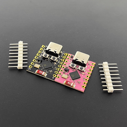
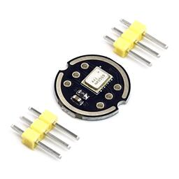
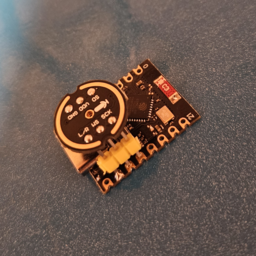

# ChirpHappens
ESPHome component for detecting whistle patterns.

## Hardware

To make the device as small as possible, the following hardware was used:

- Microcontroller: [NoLogo ESP32-C3 SuperMini](https://www.nologo.tech/product/esp32/esp32c3SuperMini/esp32C3SuperMini.html), [Pinout](https://www.sudo.is/docs/esphome/boards/esp32c3supermini/)
- Microphone: [INMP441 MEMS I2S Microphone](https://www.berrybase.de/en/inmp441-mems-omnidirektionales-mikrofonmodul-i2s-interface)
- Case: [ChirpHappens on Printables](https://www.printables.com/model/1090007-chirphappens)

  

## Software

Build dependencies: [ESPHome](https://esphome.io/guides/installing_esphome)

An example YAML configuration for the mentioned hardware can be found [here](example.yaml).

### Building & Uploading

Run the following commands to build and run the example configuration.

```bash
esphome build example.py # Build only
esphome run example.py   # Build & run
```

### Configuration

When using the hardware and pin configuration specified above, there is no need to change anything in the example configuration. Otherwise you might want to adapt to your hardware.

Enter your WiFi credentials here or just connect to the fallback hotspot and enter your credentials from there.

```yaml
# Default wifi configuration
wifi:
  # ssid: "Your WiFi SSID"
  # password: "VerySafePassword"

  # Enable fallback hotspot with captive portal in case wifi connection fails
  ap:
    ssid: "chirphappens"
    password: ""
```

Either clone the chirphappens repository and edit & run the [example.yaml](example,yaml) file from there to use the component locally or pull the component from GitHub.

```yaml
# External chirphappens component
# Either source from cloned repository or pull from GitHub
external_components:
  # - source: components
  - source:
      type: git
      url: https://github.com/chrizbee/ChirpHappens
      ref: main
    components: [ chirphappens ]
```

The default pin configuration for the hardware specified above is:

```yaml
# I2S pin configuration
pin_i2s_ws: 7        # I2S WS pin
pin_i2s_sck: 8       # I2S SCK pin
pin_i2s_sd: 4        # I2S SD pin
pin_i2s_lr: 6        # I2S L/R pin
i2s_channel: left    # I2S channel
i2s_port: I2S_NUM_0  # I2S port
```

